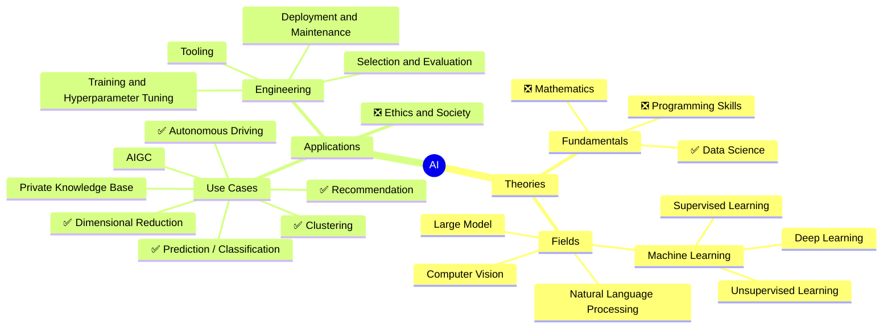

# AI Odyssey
This is name was given by both llama3.1 and llama3 as the first suggestion, so I choose it. qwen2's first suggested name was "Code Your Path to AI Mastery", not bad but seems "AI Odyssey" is better.

# Mindmap

emoji:

#️⃣
*️⃣
0️⃣
1️⃣
2️⃣
3️⃣
4️⃣
5️⃣
6️⃣
7️⃣
8️⃣
9️⃣
🔟
✅
❎