# AI Odyssey
This is name was given by both llama3.1 and llama3 as the first suggestion, so I choose it. qwen2's first suggested name was "Code Your Path to AI Mastery", not bad but seems "AI Odyssey" is better.

# Mindmap

```mermaid
mindmap
  root((AI))
    Theories
      Fundamentals
        ❎ Mathematics
        ❎ Programming Skills
        ✅ Data Science
      Fields
        Machine Learning
          Supervised Learning
          Unsupervised Learning
          Deep Learning
        Natural Language Processing
        Computer Vision
        GenAI
        Agentic AI
    Applications
      Use Cases
        ✅ Prediction / Classification
        ✅ Clustering
        ✅ Dimensional Reduction
        ✅ Recommendation
        ✅ Autonomous Driving
        Private Knowledge Base
        AIGC
        AI Agent
      Engineering
        Tooling
        Selection and Evaluation
        Training and Hyperparameter Tuning
        Deployment and Maintenance
      ❎ Ethics and Society
```

emoji:

#️⃣
*️⃣
0️⃣
1️⃣
2️⃣
3️⃣
4️⃣
5️⃣
6️⃣
7️⃣
8️⃣
9️⃣
🔟
✅
❎