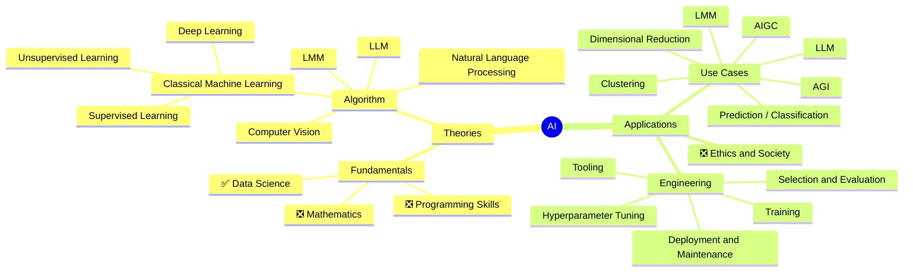

root((AI))
- Theories
  - Fundamentals
    - ✅ Mathematics
    - ❎ Programming Skills
    - ⬚ Data Science
  - Algorithm
    - Classical Machine Learning
      - Supervised Learning
        - Linear Regression
        - Decision Trees
        - Random Forests
        - Support Vector Machines
        - Neural Networks
      - Unsupervised Learning
        - Clustering
        - Dimensionality Reduction
      - Deep Learning
        - Convolutional Neural Networks
        - Recurrent Neural Networks
        - Long Short-Term Memory
    - Natural Language Processing
      - Text Preprocessing
      - Sentiment Analysis
      - Named Entity Recognition
      - Topic Modeling
    - Computer Vision
      - Image Preprocessing
      - Object Detection and Classification
      - Image Segmentation
- Applications
  - Use Cases
    - Prediction
    - Classification
    - Clustering
    - Dimensionality Reduction
    - Large Language Model
    - Artificial intelligence-generated content
    - Artificial General intelligence
  - Engineering
    - Tools: TensorFlow, Pytorch, Keras
    - Model Training
    - Model Evaluation and Selection
    - Hyperparameter Tuning
    - Model Deployment and Maintenance
  - Ethics and Society
    - AI Safety and Explainability
    - Bias and Fairness in Machine Learning
    - Human-Centered Design for AI Systems
