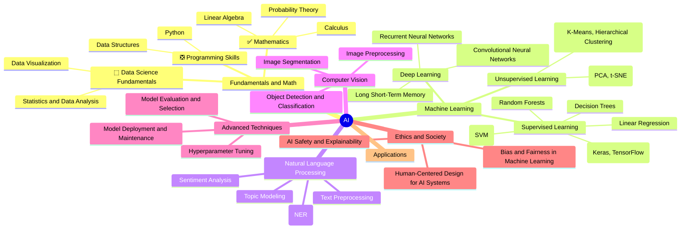

```mermaid
mindmap
  root((AI))
    Fundamentals and Math
      ✅ Mathematics
        Linear Algebra
        Calculus
        Probability Theory
      ❎ Programming Skills
        Python
        Data Structures
      ⬚ Data Science Fundamentals
        Statistics and Data Analysis
        Data Visualization
    Machine Learning
      Supervised Learning
        Linear Regression
        Decision Trees
        Random Forests
        Support Vector Machines (SVM)
        Neural Networks (Keras, TensorFlow)
      Unsupervised Learning
        Clustering (K-Means, Hierarchical Clustering)
        Dimensionality Reduction (PCA, t-SNE)
      Deep Learning
        Convolutional Neural Networks
        Recurrent Neural Networks
        Long Short-Term Memory
    Natural Language Processing
      Text Preprocessing
      Sentiment Analysis
      Named Entity Recognition (NER)
      Topic Modeling
    Computer Vision
      Image Preprocessing
      Object Detection and Classification
      Image Segmentation
    Advanced Techniques
      Model Evaluation and Selection
      Hyperparameter Tuning
      Model Deployment and Maintenance
    Ethics and Society
      AI Safety and Explainability
      Bias and Fairness in Machine Learning
      Human-Centered Design for AI Systems
    Applications
```