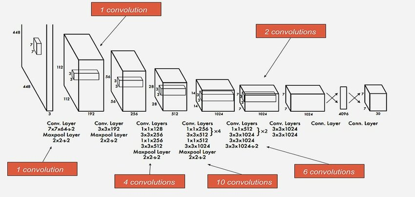
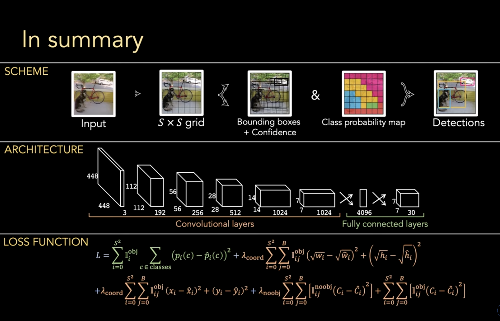

# YOLO (You Only Look Once)

#CV #YOLO #CNN

## Paper
[You Only Look Once: Unified, Real-Time Object Detection](https://arxiv.org/pdf/1506.02640)

## Architecture

## Resource
- [How YOLO Object Detection Works](https://www.youtube.com/watch?v=svn9-xV7wjk&t=170s)

- [What is YOLO algorithm? | Deep Learning Tutorial 31 (Tensorflow, Keras & Python)](https://www.youtube.com/watch?v=ag3DLKsl2vk)