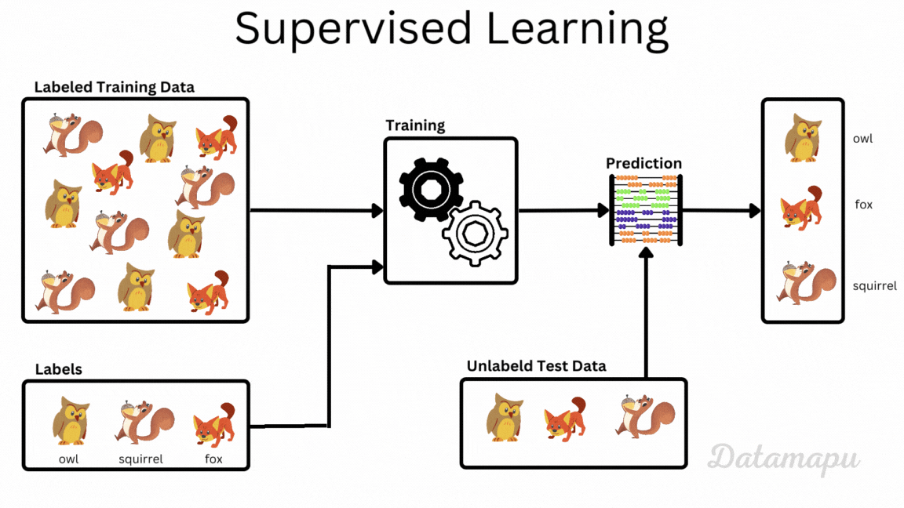
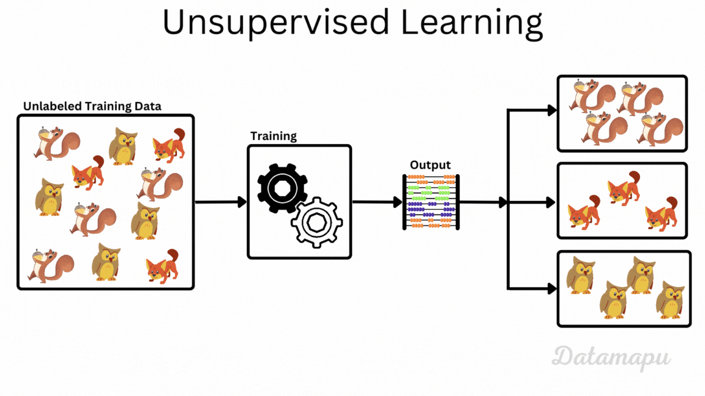
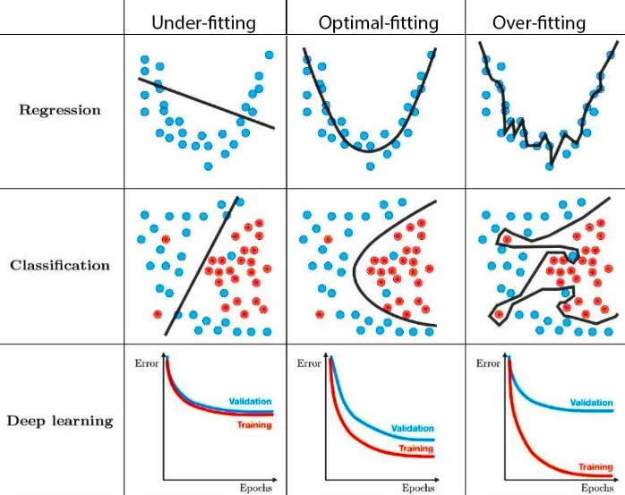

# Classical Machine Learning

#supervisedLearning #unsupervisedLearning #semiSupervisedLearning #underFitting #overFitting #epoch #error

## Applicaiton Summary

## Supervised Learning

## Unsupervised Learning

### Semi Supervised Learning
- pseudo-labeling

    

## Knowledge Points
- labeled vs. unlabeled data

    
- under fitting vs. over fitting

    
