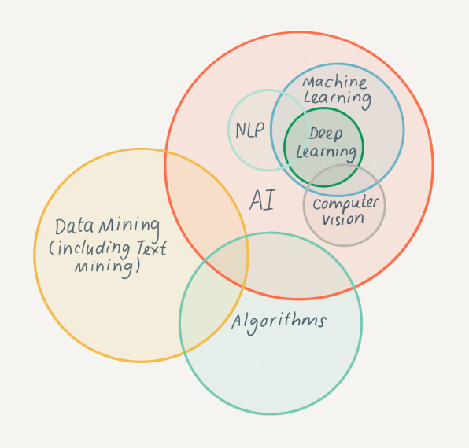
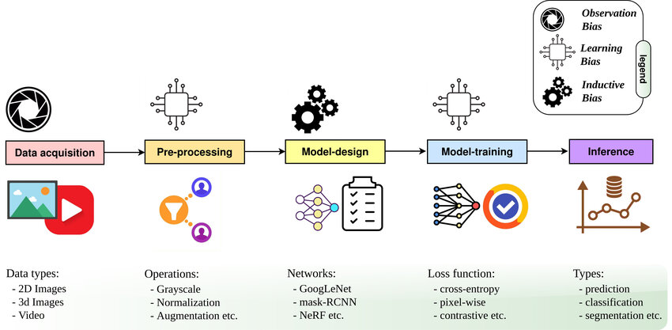
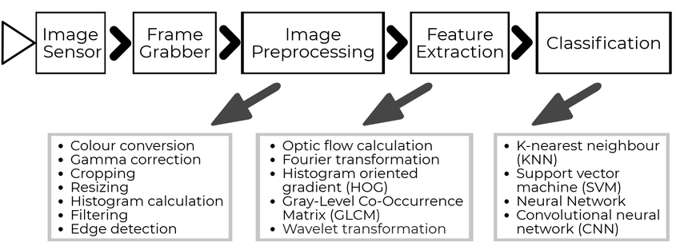
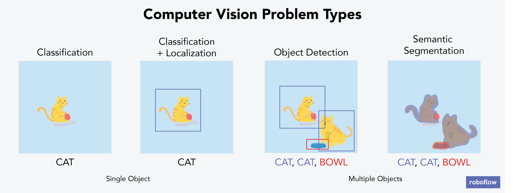

# Computer Vision

#CV #SSD #CNN #YOLO #R-CNN #deepLearning

Computer Vision (CV) is a subfield of artificial intelligence (AI) that enables computers to interpret and understand visual information from images, videos, and other visual data. It involves the development of algorithms and techniques that allow computers to extract insights, make decisions, or perform tasks based on visual data.

The primary goals of computer vision are:

1. **Image recognition**: To identify objects, scenes, or activities within an image or video.
2. **Object detection**: To locate specific objects or patterns within an image or video.
3. **Scene understanding**: To comprehend the context and meaning of an image or video.
4. **Action recognition**: To detect and classify human actions or movements.

Computer vision is used in a wide range of applications, including:

1. **Self-driving cars**: Computer vision is used to detect pedestrians, lanes, traffic lights, and other objects on the road.
2. **Facial recognition**: Computer vision is used to identify individuals based on their facial features.
3. **Medical imaging analysis**: Computer vision is used to analyze medical images such as X-rays and MRI scans.
4. **Surveillance systems**: Computer vision is used to monitor and track people or objects in real-time.
5. **Robotics**: Computer vision is used to enable robots to perceive and interact with their environment.

Some common techniques used in computer vision include:

1. **Convolutional Neural Networks (CNNs)**: A type of neural network that uses convolutional layers to extract features from images.
2. **Object detection algorithms**: Such as YOLO, SSD, and Faster R-CNN, which detect objects within an image or video.
3. **Deep learning techniques**: Such as transfer learning and attention mechanisms, which enable computers to learn from large datasets.

The benefits of computer vision include:

1. **Improved accuracy**: Computer vision enables computers to make accurate decisions based on visual data.
2. **Increased efficiency**: Computer vision can automate many tasks, such as object detection and tracking.
3. **Enhanced decision-making**: Computer vision provides insights that can inform business decisions or improve safety.

However, computer vision also has some limitations and challenges, including:

1. **Data quality**: The accuracy of computer vision algorithms depends on the quality of the visual data.
2. **Variability in lighting conditions**: Lighting conditions can affect the performance of computer vision algorithms.
3. **Contextual understanding**: Computer vision may struggle to understand the context and meaning of an image or video.

Overall, computer vision is a rapidly evolving field that has numerous applications in various industries, and its development continues to advance our ability to interpret and understand visual data.
---

## Computer Vision Domain

## Computer Vision vs. Human Vision

## Computer Vision Applications

## Computer Vision Pipeline

## Computer Vision Training

## [Computer Vision Inference](https://www.learnpytorch.io/03_pytorch_computer_vision/)

### Computer Vision Interence Types
