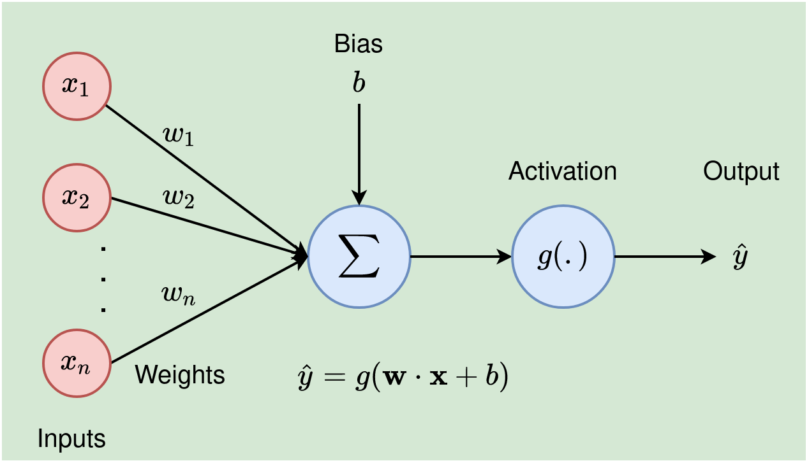
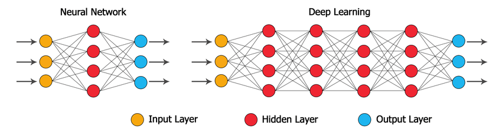

#deepLearning #neuralNetwork #CNN #RNN #transformer

# Neural Network
## Neuron


### Formula
```math
\hat{y} = g({\bf W} * {\bf X} + b)
```
- Inputs X
```math
{\bf X} = x1, x2, x3 ...
```
- Weights W
```math
{\bf W} = w1, w2, w3 ...
```
- Activation (see [activation](./activationFunction.md))
```math
g(.)
```
- Output
```math
\hat{y}
```

## Neural Network


# Deep Learning

## Deep Learning in CNN

