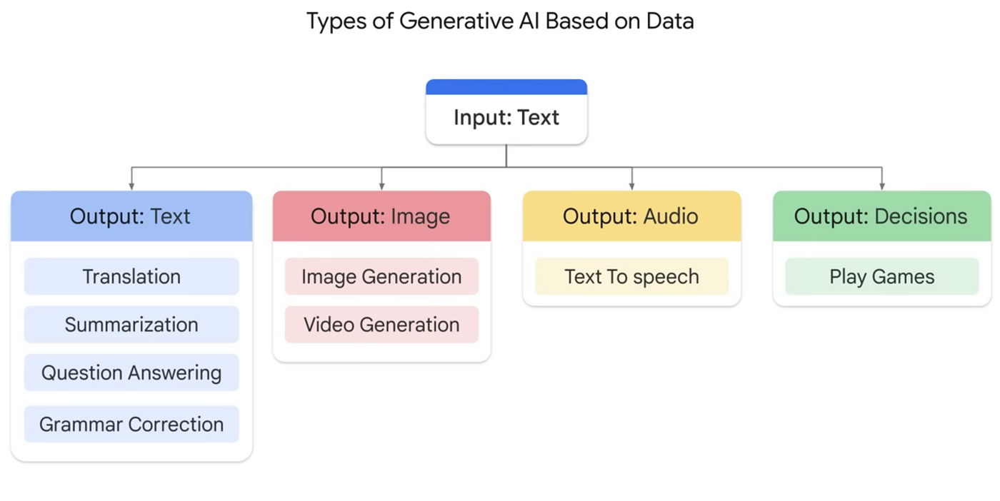
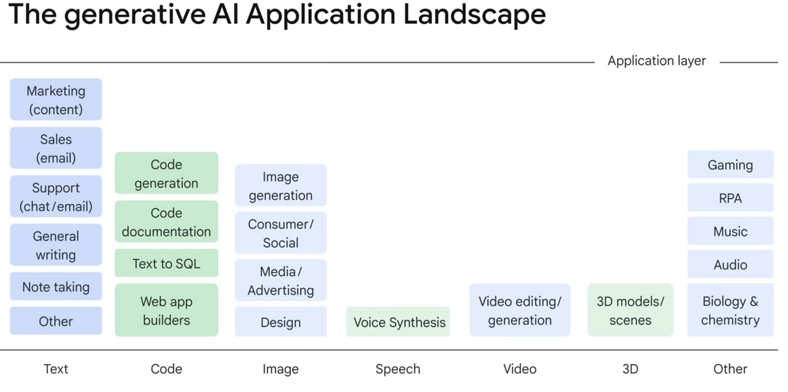

### What is Generative Artificial Intelligence (GenAI)?

#GenAI

Generative Artificial Intelligence (GenAI) refers to a subset of artificial intelligence that focuses on generating human-like content, such as text, images, audio, or video. The primary goal of GenAI is to create new data that mimics real-world data and can be used in various applications.

**Key Features of GenAI:**

1. **Content Creation**: GenAI can generate text, code, art, music, and more, often with high quality and creativity.
2. **Autonomous Learning**: These models are trained on large datasets to learn patterns and structures in the data.
3. **Customization**: Users can provide specific inputs or parameters to tailor the generated content.

**Applications of GenAI:**

1. **Content Generation**: Creating articles, stories, product descriptions, etc.
2. **Creative Arts**: Producing music, poetry, paintings, and other artistic works.
3. **Software Development**: Generating code snippets, documentation, and even entire applications.
4. **Customer Service**: Automating responses in chatbots to provide personalized support.

**Examples of GenAI:**

- **Text Generation**: Tools like GPT (Generative Pre-trained Transformer) can create coherent paragraphs or whole articles.
- **Image Synthesis**: Models like DALL-E can generate images based on textual descriptions.
- **Code Generation**: Systems that automatically generate code for developers, improving productivity.

**Challenges and Considerations:**

1. **Ethical Use**: Ensuring the responsible use of GenAI to avoid issues like copyright infringement or misleading information.
2. **Bias Management**: Addressing potential biases in training data to ensure generated content is fair and unbiased.
3. **Human Interaction**: Maintaining a balance between automation and human oversight, especially in critical applications.

GenAI is transforming various industries by enabling the creation of high-quality, customized content with minimal effort. As the technology advances, it continues to expand its applications and impact on our daily lives.

---

