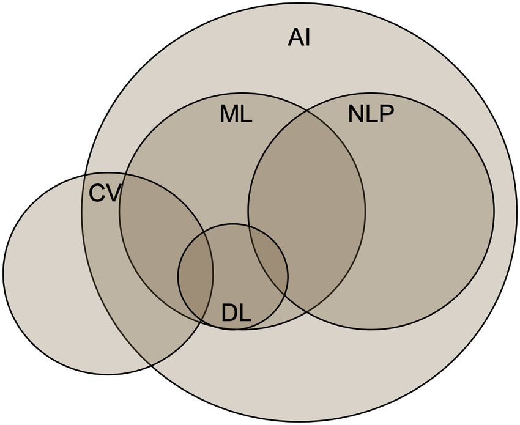

**What is NLP?**

#NLP #tokenization #LLM #STT #TTS

Natural Language Processing (NLP) is a field of study that focuses on the interaction between computers and humans in natural language. It deals with the way computers understand, interpret, and generate human language.

**Goals of NLP:**

1. **Understanding**: Enable computers to comprehend the meaning of human language.
2. **Generation**: Allow computers to generate human-like text or speech.
3. **Interaction**: Facilitate communication between humans and computers through natural language.

**Key areas of NLP:**

1. **Text Processing**: Tokenization, stemming, lemmatization, named entity recognition, etc.
2. **Sentiment Analysis**: Determine the sentiment (positive, negative, neutral) behind human language.
3. **Language Modeling**: Predict the next word in a sequence based on context and probability.
4. **Machine Translation**: Translate text from one language to another.

**Applications of NLP:**

1. **Chatbots**: Create conversational interfaces for customer service, entertainment, or education.
2. **Sentiment Analysis**: Analyze customer feedback to improve product development and marketing.
3. **Language Translation**: Facilitate communication across languages and cultures.
4. **Speech Recognition**: Recognize spoken language and perform tasks such as dictation or voice control.

NLP has many practical applications in areas like customer service, marketing, healthcare, education, and more!

---

